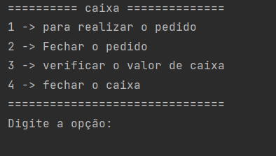
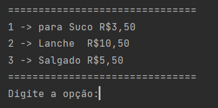
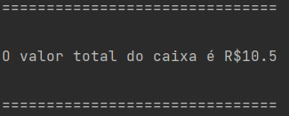
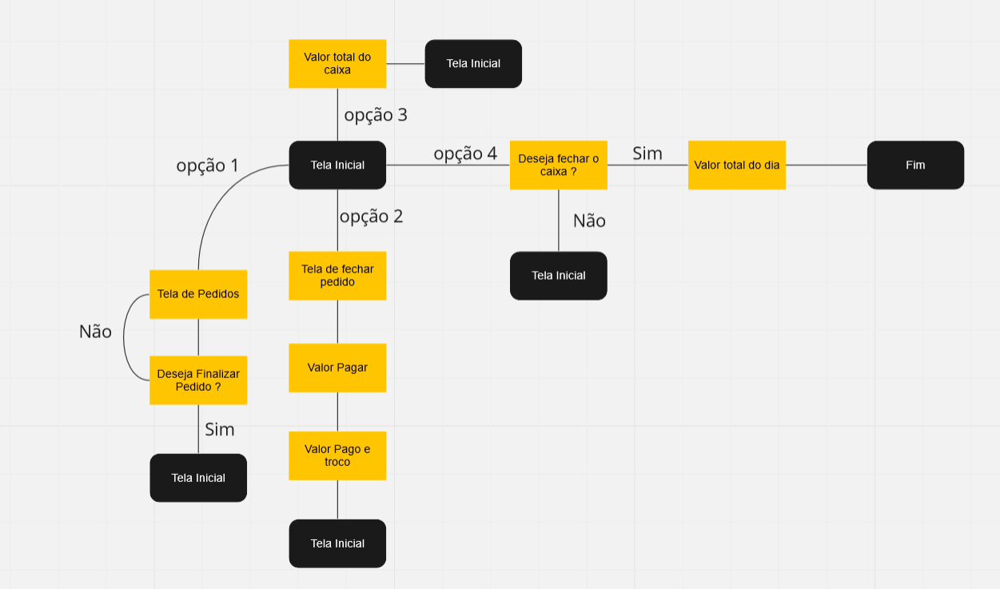
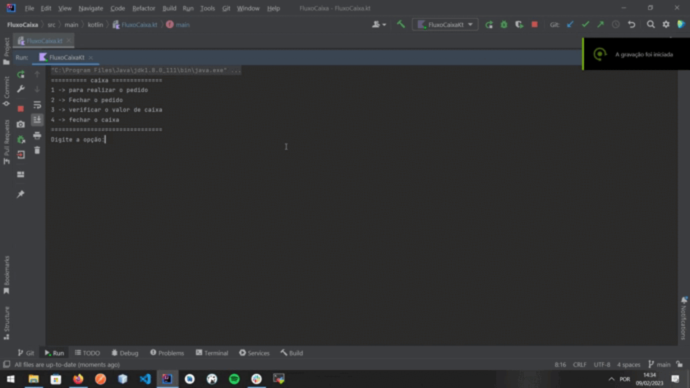

<h1 align="center">fluxo de caixa</h1>

    
  <a href="mailto:heitorpreviero@gmail.com"><a/>
  <a href="https://www.linkedin.com/in/heitor-feltrin-previero-b6982814a/"><a/>
<a href="https://wa.me/+55 14981754016"><a/>

  

⭐ Esse é um projeto para demonstrar meu conhecimento técnico sobre Kotlin. Mais informações técnicas abaixo.

🎥 Esse projeto e uma criação de fluxo de caixa feito com script de Kotlin e é executado pelo terminal de comando. 

 

## Tecnologias usadas 

- [Linguagem Kotlin](https://kotlinlang.org/)

## Fluxograma

 
    
## Feature

- A tela inical será apresentado quatro opção para realizar o proceso.
- Na opção 1 será realizado o pedido onde pode escolher em tres opção e depois voltar ou voltar a tela inicial.
- Na opção 2 será feito combraça do pedido onde recebera o valor pago depois será informado o valor do troco caso sejá nescessario.
- Na opção 3 será mostrado o valor do caixa na aquele momento.
- Na opção 4 fecha o caixa caso queria se não volta a tela inicial

